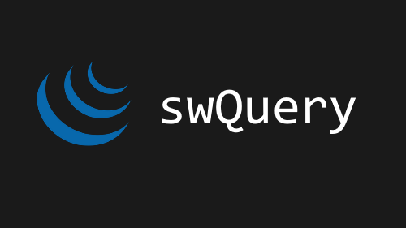

# swQuery

    
     
    
    
    
    

**Meu repositório para micro-projetos em jQuery. Feitos para aprendizado e para incrementar o portfólio**

Projeto lançado <a href="https://swshadows.github.io/swquery/index.html">aqui</a>
